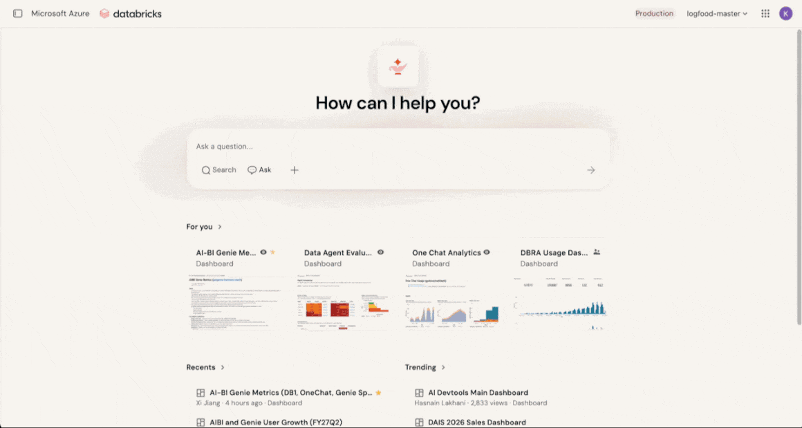
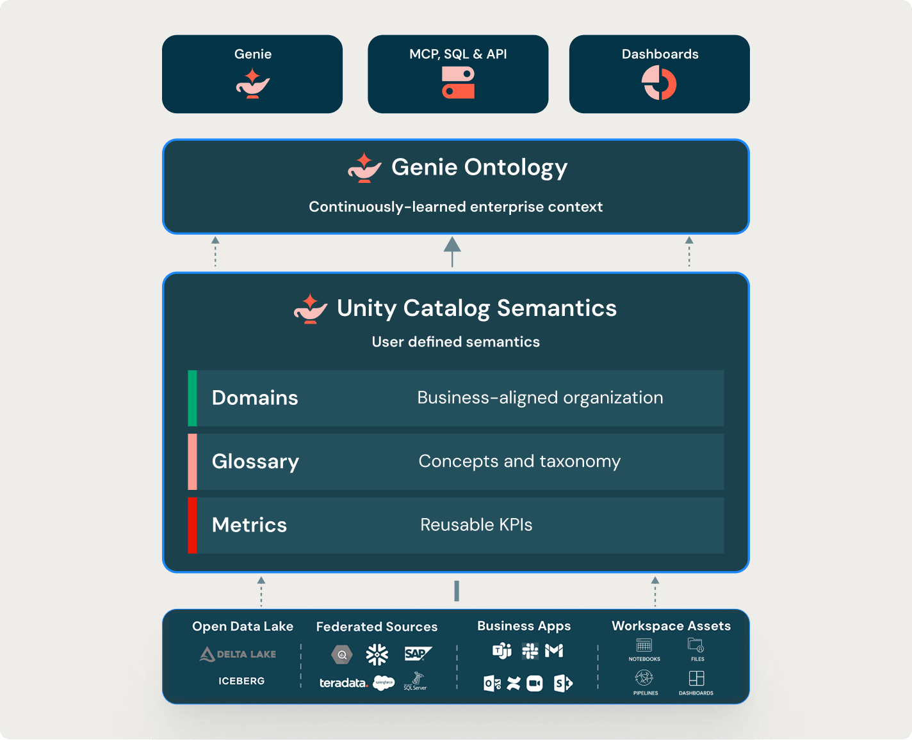

# Introduction to Unity Catalog Business Semantics

## The Open, Governed Semantic Layer for Humans, BI, and AI

Unity Catalog Business Semantics is Databricks' answer to one of the most persistent challenges in enterprise data: **ensuring that everyone — humans, dashboards, and AI agents — speaks the same business language when interpreting data.**





---

## What Is Unity Catalog Business Semantics?

Unity Catalog semantics is a collection of tools for defining standard business metrics, terms, and organizational structures on top of your catalog data. It ensures that both human users and AI tools interpret data consistently under a single governance model.

It forms the **human-modeled layer** of the **Genie Ontology** — the governed business context that people explicitly define. Genie One then combines this modeled context with context it infers automatically from assets and usage, forming a unified context layer that powers conversational analytics, dashboards, and API-driven experiences.

---

## Core Components

Unity Catalog Business Semantics consists of four primary components:

### 1. Metric Views — Reusable Business KPIs

Metric views are the core implementation of UC semantics. They provide a centralized way to define and manage business metrics by separating **measure definitions** from **fields (dimensions)** used to group, filter, and aggregate them.

Unlike standard views that lock in aggregations and groupings at creation time, metric views let you define a metric once (e.g., *sum of revenue divided by distinct customer count*) and query it at runtime with any available grouping. The query engine generates the correct computation dynamically.

**Key capabilities:**

* **Define once, reuse everywhere** — dashboards, Genie Agents, alerts, notebooks, and SQL workflows all consume the same governed metric definition
* **Separate measures from dimensions** — measures define *what* to calculate; fields define *how* to slice it
* **Star and snowflake schema joins** — model complex relationships with multi-level joins
* **Window measures** — trailing averages, period-over-period changes, and cumulative totals
* **Parameterization** — bind values at query time to serve many query variants from a single metric view
* **Materialization** — pre-compute and incrementally refresh aggregations; the query engine auto-rewrites queries to use materialized results
* **Agent metadata** — synonyms, display names, and formatting rules that improve AI accuracy and display consistency

**SQL syntax:**

```sql
CREATE OR REPLACE VIEW orders_metrics
WITH METRICS LANGUAGE YAML AS
$$
version: 1.1
source: prod.operations.orders_enriched
fields:
  - name: category
    expr: category
  - name: order_date
    expr: order_date
measures:
  - name: total_revenue
    expr: SUM(revenue)
  - name: avg_order_value
    expr: AVG(order_total)
  - name: customer_count
    expr: COUNT(DISTINCT customer_id)
$$;
```

Metric views are **Unity Catalog securable objects** — governed with standard UC privileges, manageable through Catalog Explorer or SQL.

### 2. Domains — Business-Aligned Organization

Domains are an organization layer that groups data assets by **business purpose** so users can browse and find data in terms they understand — not by technical catalog structure.

**How they work:**

* Built on **governed tags** — assigning an asset to a domain means tagging it with the domain's governed tag
* **Subdomains** partition large areas into more specific business concerns (e.g., Finance → Audit, Tax, FP&A) using a `{parentDomain}/{subdomain}` naming pattern
* Assets can belong to **multiple domains/subdomains**
* Domains surface in the **Discover page** — a curated browsing experience for finding data by business area
* Each domain can have designated **Technical Owners** and **Business Owners**
* Domains support **draft and published** states for curation control

**Relationship to catalogs:** Catalogs remain the primary governance/organization unit for data objects. Domains are a semantic discovery layer *on top of* the catalog hierarchy — they don't replace catalogs, they complement them with business context.

### 3. Pages — Governed Business Concepts (Glossary)

Pages give each business concept and term an **authoritative definition**. They function as a governed business glossary within Unity Catalog.

**What Pages provide:**

* Structured definitions with **synonyms, descriptions, page body, related assets, and sources**
* Pages belong to a **domain or subdomain**, organizing concepts by business area
* When Genie One answers a question about a concept defined in a Page, it **prioritizes the Page definition over inferred context** and cites the Page
* Pages serve as the authoritative source for both humans browsing the Discover experience and AI agents interpreting questions

**Practical impact:** When your CFO asks "What is ARR?" and your data analyst asks the same question in a Genie space, they both get the same governed answer — backed by the same Page definition.

### 4. Certification and Deprecation — Trust Signals

Certification and deprecation mark data assets as **trusted or outdated**, adding a layer of authority on top of definitions:

* **Certification** signals that your organization vouches for an asset — steering Genie One toward authoritative sources and giving users confidence in the data they consume
* **Deprecation** signals that an asset is outdated — steering users and AI away from stale or superseded definitions

These signals work in concert with the other semantics components to ensure that the right data surfaces in the right contexts.

---

## The Genie Ontology: Where It All Comes Together

Unity Catalog Business Semantics is the **human-modeled layer** of a larger system: the **Genie Ontology**.

The Genie Ontology combines:

1. **User-defined semantics** (metric views, domains, Pages, certification) — what humans explicitly define and govern
2. **Inferred context** — what Genie learns automatically from existing assets, usage patterns, dashboards, SQL queries, and notebooks

This combined ontology powers:

* **Genie One / Genie Agents** — conversational analytics grounded in enterprise context
* **Dashboards** — automatically generated Genie Agents from dashboard datasets and visualizations
* **MCP / SQL / API consumers** — the Genie One MCP server exposes the ontology to external agents and programmatic consumers
* **Genie Code** — context-aware coding assistance that understands your business terminology

**The hierarchy of authority:**

1. Human-defined semantics win when they exist and are relevant
2. Inference fills gaps, learns from usage, and improves over time
3. The combined ontology powers responses and routing across all Genie experiences

---

## Why Customers Should Adopt UC Business Semantics

### 1. Single Source of Truth for Metrics

Define a KPI once and reuse it consistently across every analytics surface. No more duplicated revenue calculations across 15 dashboards, each with slightly different logic. When the business definition changes, update it in one place.

### 2. Eliminate Metric Drift and Reconciliation Fights

Metric views prevent different teams from recreating the same KPI differently in dashboards, notebooks, spreadsheets, or agents. The result: fewer reconciliation disputes over which number is correct and less time spent auditing discrepancies.

### 3. Dramatically Better AI/BI Answers

Semantic metadata gives AI tools the context they need to interpret data accurately. Genie can answer questions using **business terms** instead of guessing from raw schema alone. Pages ensure AI cites authoritative definitions rather than hallucinating meanings.

### 4. True Self-Service Analytics

Business users can ask questions in their own language without needing to know physical tables, join keys, or column names. Metric views handle the computation; domains and Pages handle the translation from business intent to data reality.

### 5. Federated Ownership with Centralized Governance

Domains enable business units to own and organize their data products while still operating under unified governance policies. Technical and business owners are explicitly designated. Permissions, lineage, and audit trails remain centrally managed through Unity Catalog.

### 6. Open, Not Locked

Unlike proprietary BI semantic models that trap definitions inside a single tool, UC Business Semantics is an **open semantic layer** built into the data platform itself. Definitions are accessible to any consumer — dashboards, notebooks, agents, MCP clients, or third-party tools — without vendor lock-in.

### 7. Faster Time to Insight

New analysts onboard faster when business concepts are discoverable through Domains and defined authoritatively in Pages. Data exploration shifts from "find someone who knows" to browsing a governed catalog of business meaning.

### 8. Safer, More Governed AI Adoption

As organizations expose data to copilots, agents, and AI experiences, UC Business Semantics ensures those AI tools operate within governed boundaries — using certified sources, authoritative definitions, and explicitly modeled business logic rather than inferring (potentially incorrectly) from raw data.

### 9. Compliance and Auditability

Semantic objects inherit Unity Catalog's governance framework: fine-grained access control, lineage tracking, and activity logging. Every metric, concept, and domain is a securable object with clear ownership and permission boundaries.

---

## Architecture in Practice

```
┌─────────────────────────────────────────────────────────────┐
│                    Consumers                                │
│   Genie One  │  Dashboards  │  MCP/API  │  Notebooks       │
└──────────────┬──────────────┬───────────┬──────────────────-┘
               │              │           │
┌──────────────▼──────────────▼───────────▼──────────────────-┐
│                  Genie Ontology                              │
│        Continuously-learned enterprise context              │
└──────────────────────────┬──────────────────────────────────┘
                           │
┌──────────────────────────▼──────────────────────────────────┐
│           Unity Catalog Semantics                            │
│              User-defined semantics                          │
│                                                             │
│   ┌──────────┐  ┌──────────┐  ┌──────────┐  ┌────────┐    │
│   │ Domains  │  │  Pages   │  │ Metrics  │  │ Trust  │    │
│   │          │  │(Glossary)│  │  Views   │  │Signals │    │
│   └──────────┘  └──────────┘  └──────────┘  └────────┘    │
└──────────────────────────┬──────────────────────────────────┘
                           │
┌──────────────────────────▼──────────────────────────────────┐
│                 Data Sources                                 │
│  Delta Lake │ Iceberg │ Federated │ Business Apps           │
└─────────────────────────────────────────────────────────────┘
```

---

## Getting Started

1. **Start with Domains** — Map your organizational structure to domains and subdomains. Assign owners.
2. **Define Pages for key concepts** — Document your most contentious business terms (ARR, active customer, churn) as Pages with authoritative definitions.
3. **Build Metric Views for critical KPIs** — Begin with 5-10 metrics that are most commonly duplicated or disputed across teams.
4. **Certify trusted assets** — Mark your golden datasets and metric views as certified to steer AI and users toward authoritative sources.
5. **Iterate with Genie** — Use Genie One to test whether your semantic definitions produce correct, consistent answers. Refine based on how AI interprets your data.

---

## Key References

* [Unity Catalog Semantics Documentation](https://docs.databricks.com/aws/en/uc-semantics/)
* [Metric Views — Create, Model, and Manage](https://docs.databricks.com/aws/en/uc-semantics/metric-views/)
* [Metric View YAML Syntax Reference](https://docs.databricks.com/aws/en/uc-semantics/metric-views/yaml-reference/)
* [Domains and Subdomains](https://docs.databricks.com/aws/en/uc-semantics/domains/)
* [Pages — Governed Business Concepts](https://docs.databricks.com/aws/en/uc-semantics/pages/)
* [Data Discovery in Unity Catalog](https://docs.databricks.com/aws/en/data-governance/unity-catalog/data-discovery/)
* [Genie One MCP Server](https://docs.databricks.com/aws/en/agents/mcp-tools/genie-mcp/)
* [Data+AI Summit: A-Z of UC Business Semantics](https://www.databricks.com/dataaisummit/session/z-unity-catalog-business-semantics-open-and-unified-semantics-agents)
* [Data+AI Summit: BI Locked Semantic Models are Dead](https://www.databricks.com/dataaisummit/session/bi-locked-semantic-models-are-dead-open-semantics-just-entered-chat)

---

*Last updated: August 2026*
